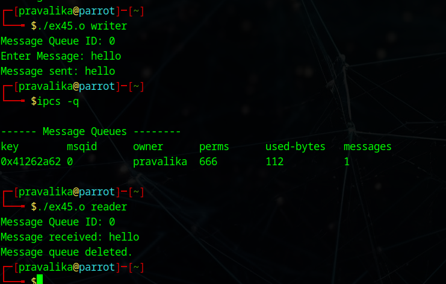

# Linux-IPC-Message-Queues
Linux IPC-Message Queues

# AIM:
To write a C program that receives a message from message queue and display them

# DESIGN STEPS:

### Step 1:

Navigate to any Linux environment installed on the system or installed inside a virtual environment like virtual box/vmware or online linux JSLinux (https://bellard.org/jslinux/vm.html?url=alpine-x86.cfg&mem=192) or docker.

### Step 2:

Write the C Program using Linux message queues API 

### Step 3:

Execute the C Program for the desired output. 

# PROGRAM:

## C program that receives a message from message queue and display them

// ex4.c - Combined Writer/Reader for System V Message Queue
```````

#include <stdio.h>
#include <stdlib.h>
#include <string.h>
#include <sys/ipc.h>
#include <sys/msg.h>

struct mesg_buffer {
    long mesg_type;
    char mesg_text[100];
} message;

int main(int argc, char *argv[]) {
    key_t key;
    int msgid;

    if (argc != 2) {
        printf("Usage: %s writer|reader\n", argv[0]);
        return 1;
    }

    // Generate key
    key = ftok("progfile", 65);

    if (key == -1) {
        perror("ftok");
        return 1;
    }

    // Create message queue and return ID
    msgid = msgget(key, 0666 | IPC_CREAT);

    if (msgid == -1) {
        perror("msgget");
        return 1;
    }

    // Print message queue ID
    printf("Message Queue ID: %d\n", msgid);

    // WRITER
    if (strcmp(argv[1], "writer") == 0) {

        message.mesg_type = 1;

        printf("Enter Message: ");
        fgets(message.mesg_text, sizeof(message.mesg_text), stdin);

        // Remove newline
        message.mesg_text[strcspn(message.mesg_text, "\n")] = 0;

        // Send message
        if (msgsnd(msgid, &message, sizeof(message), 0) == -1) {
            perror("msgsnd");
            return 1;
        }

        printf("Message sent: %s\n", message.mesg_text);
    }

    // READER
    else if (strcmp(argv[1], "reader") == 0) {

        // Receive message
        if (msgrcv(msgid, &message, sizeof(message), 1, 0) == -1) {
            perror("msgrcv");
            return 1;
        }

        printf("Message received: %s\n", message.mesg_text);

        // Destroy message queue
        if (msgctl(msgid, IPC_RMID, NULL) == -1) {
            perror("msgctl");
            return 1;
        }

        printf("Message queue deleted.\n");
    }

    // INVALID ARGUMENT
    else {
        printf("Invalid argument. Use writer or reader.\n");
        return 1;
    }

    return 0;
}
```````


## OUTPUT




# RESULT:
The programs are executed successfully.
